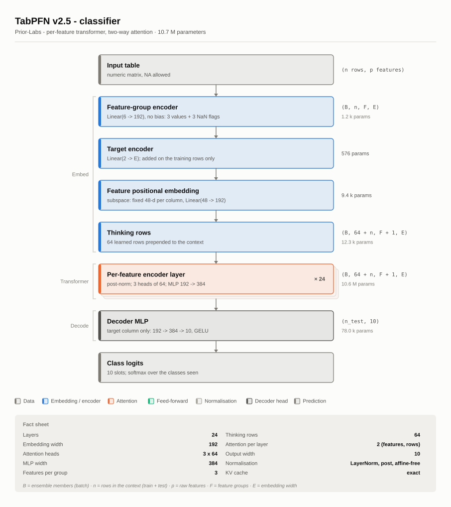
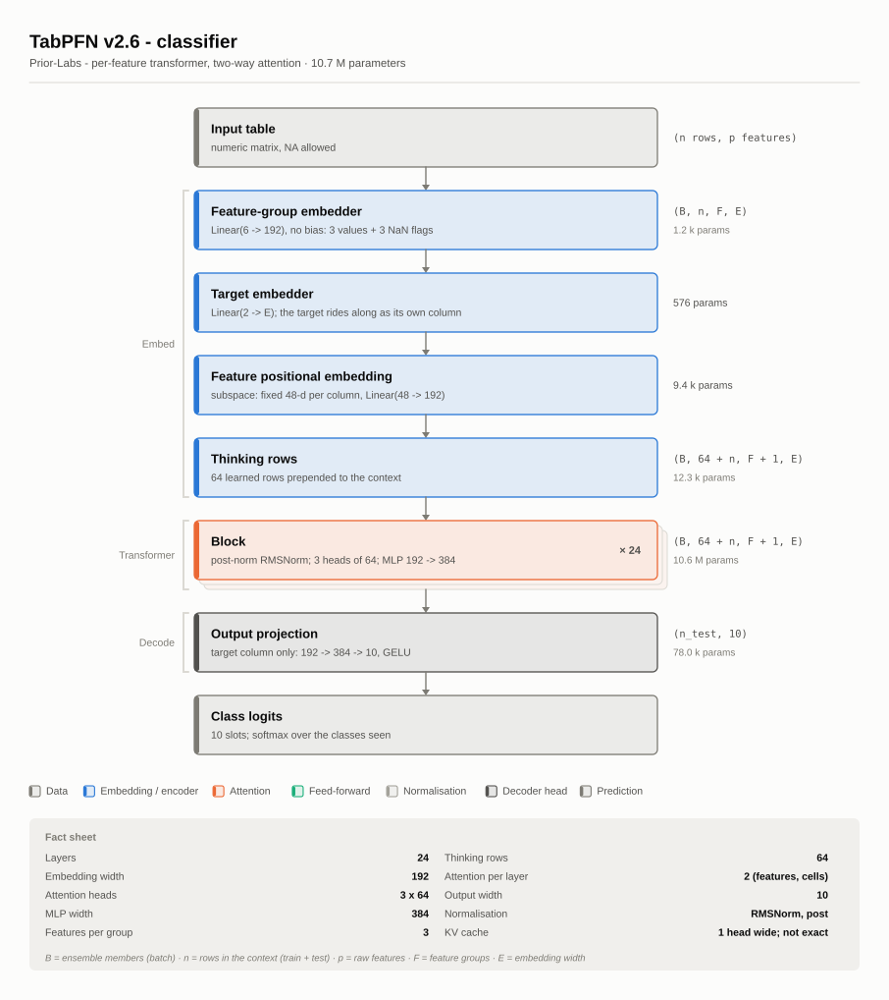
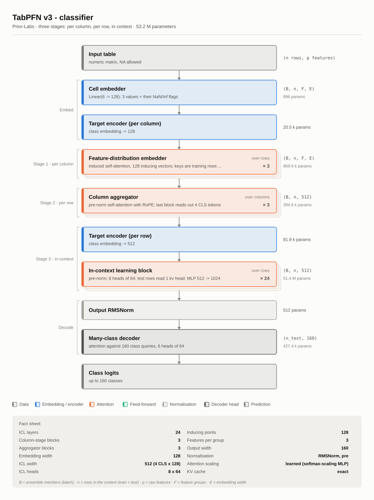
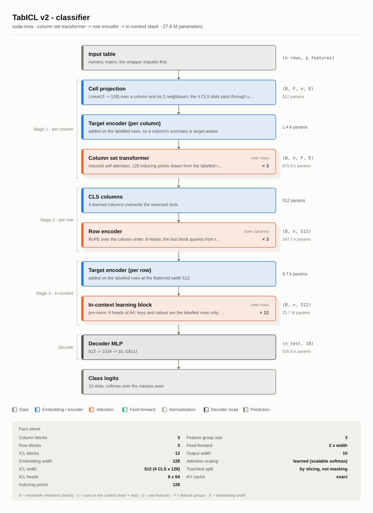
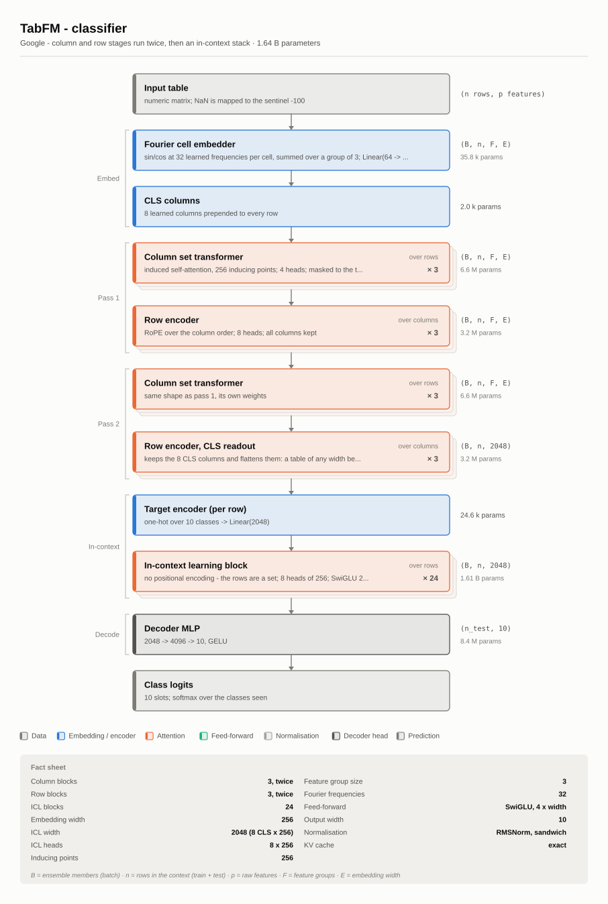
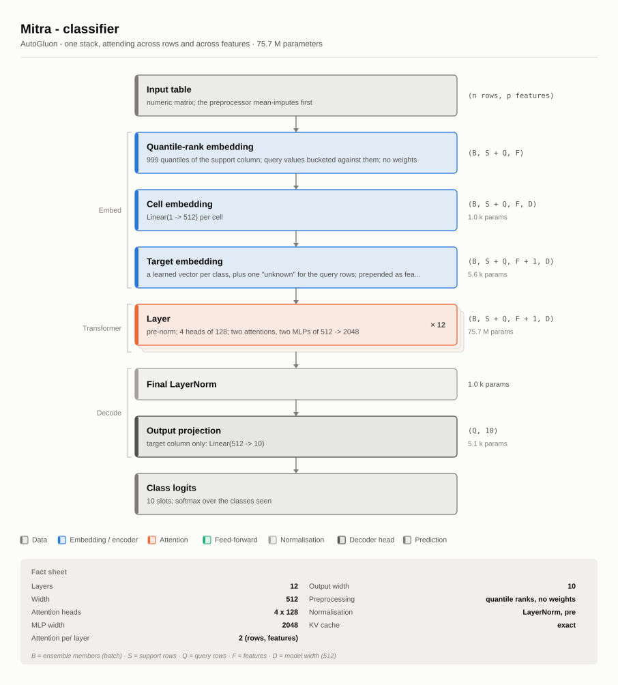
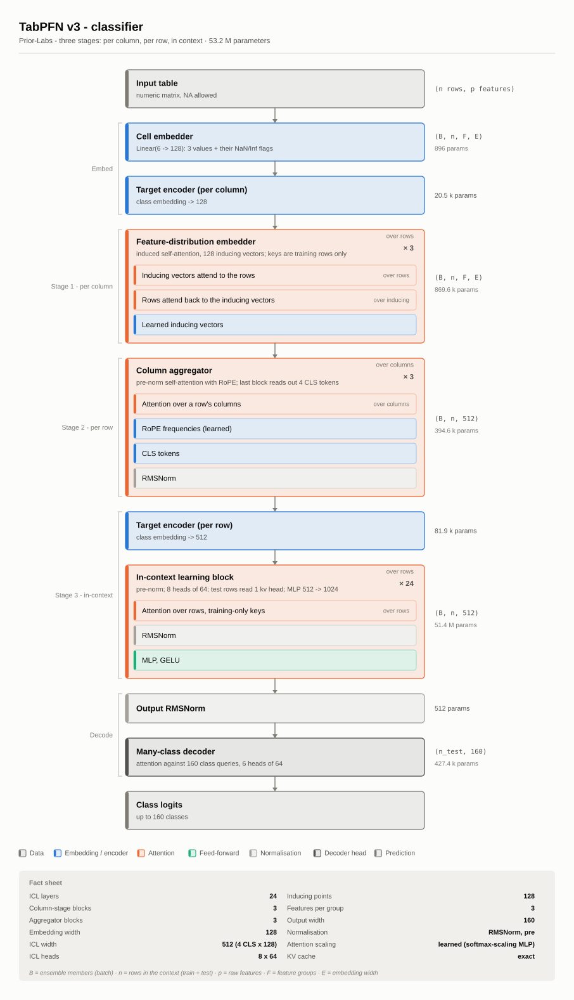
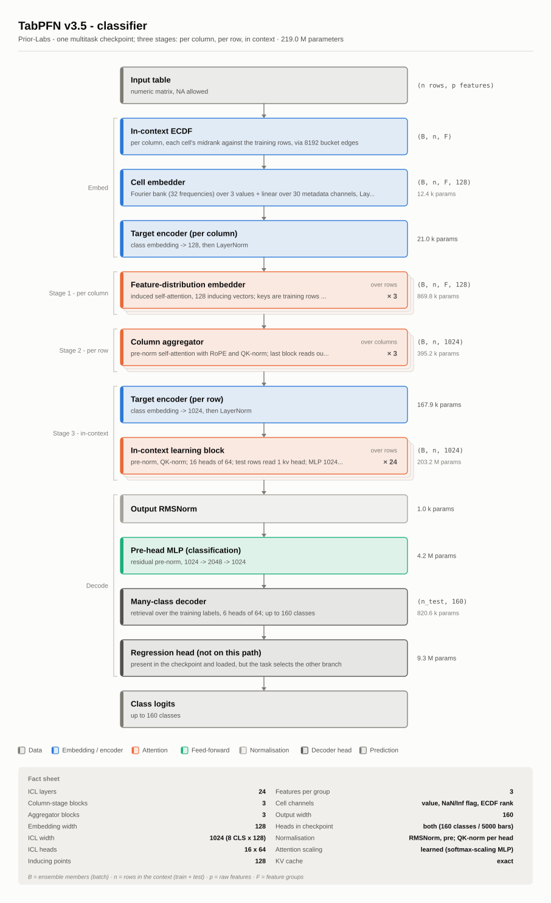
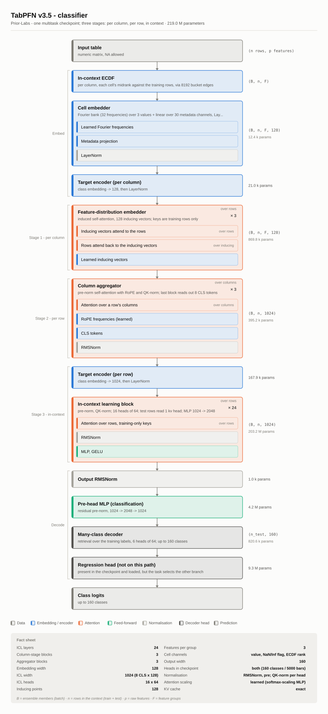
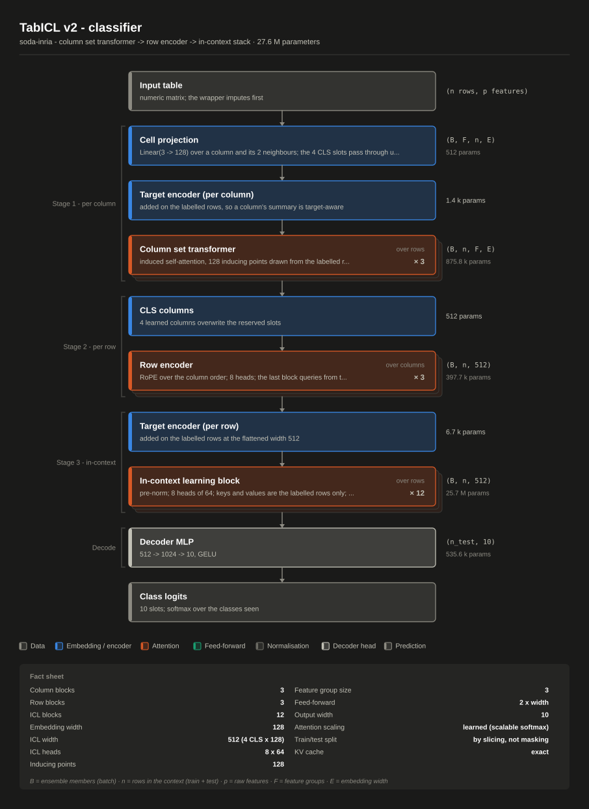

```{r}
#| label: setup
#| include: false
knitr::opts_chunk$set(collapse = TRUE, comment = "#>")
```

## Six architectures, drawn from the models

Every diagram below was produced by `plot_architecture()` from a loaded
model — not drawn by hand and not transcribed from a paper. The stages
come from the backend's own description of its network; the widths, head
counts and parameter totals are read off the network that was built from
the published checkpoint's `config.json`.

The layout owes its shape to Sebastian Raschka's
[LLM architecture gallery](https://sebastianraschka.com/llm-architecture-gallery/):
blocks stacked in the order they run, repeated blocks drawn once with
their repeat count, a fact sheet underneath. What is different here is
the thing that makes a tabular foundation model a tabular foundation
model, and which a language model has no equivalent of: **an attention
layer has an axis**. It can run down a column, across a row's features,
or over the rows of the table. Each attention block carries that axis as
a tag, and it is the single most useful thing to compare across the seven.

```{r}
#| label: backends
library(tabfound)
list_backends()
```

Drawing any of them is two lines:

```{r}
#| eval: false
clf <- tabular_classifier("tabpfn-v2.5-classifier")
plot_architecture(clf, "tabpfn.svg")
```

`file = NULL` draws on the current graphics device instead, so
`plot(clf)` works the way it does for any other model object. The
extension picks the format — `.svg`, `.png` or `.pdf`.

### How these particular figures were made

The vignette ships the SVGs rather than building them, because
instantiating all seven networks at their published widths allocates
about 2 billion parameters and takes a couple of minutes — too much
to pay on every `R CMD build`. The script that made them is
[`inst/gallery/make-gallery.R`](https://github.com/marcel-neunhoeffer/tabfound/blob/main/inst/gallery/make-gallery.R):

```bash
Rscript inst/gallery/make-gallery.R vignettes/figures
```

It reads each model's `config.json` and builds the network **without
loading any weights**. That is not a shortcut for the numbers: a
diagram depends on the config, which fixes the architecture, and on the
*shapes* of the parameters, which the config fixes too. Nothing on
these figures depends on the values in the tensors, so a randomly
initialised network reports exactly what the trained one does. It is
also why the script needs no gigabytes on disk — for TabFM and Mitra it
fetches a few hundred bytes of JSON and nothing else.


## The three TabPFN generations

The clearest comparison in the gallery, because the three are the same
lineage and you can watch the design change.

### TabPFN v2.5

One embedding pass, then 24 identical layers that each attend twice —
across a row's feature groups, then down each feature's column — and a
two-layer decoder. The two attentions *are* the architecture; nothing
else in the stack moves information between rows or between columns.

{fig-alt="Stacked block
diagram of the TabPFN v2.5 classifier"}

### TabPFN v2.6

The same two-way shape, restated: RMSNorm instead of an affine-free
LayerNorm, no biases anywhere, and the target promoted from a side
input to a column of its own that the prediction is read back out of.
The whole parameter difference is those norms — v2.5's LayerNorms have
nothing to learn, v2.6's three RMSNorms per block have 192 weights
each, and 24 × 3 × 192 = 13,824 is exactly the gap between 10,718,218
and 10,732,042.

{fig-alt="Stacked block
diagram of the TabPFN v2.6 classifier"}

### TabPFN v3

v3 gives up the single stack that attends both ways and splits the work
into three: summarise each column's distribution over the rows,
aggregate a row's columns into a fixed-width vector, then run a deep
in-context stack over rows at that wider width. Note where the
parameters went — 51.4 M of 53.2 M sit in stage 3, at a width of 512
rather than 128, because the column aggregator reads out four CLS
tokens and 4 × 128 = 512.

{fig-alt="Stacked block
diagram of the TabPFN v3 classifier"}

## The other three architectures

### TabICL v2

Structurally a cousin of TabPFN v3 — column stage, row stage, in-context
stage — arrived at independently, and different in every detail: affine
LayerNorm, a packed q/k/v projection, a scalable softmax on the
length-varying attentions. Its distinctive choice is that the labelled
rows are held apart from the test rows by *slicing*, never by masking:
a labelled row cannot see a test row at any stage, which is what makes
its KV cache exact.

{fig-alt="Stacked block
diagram of the TabICL v2 classifier"}

### TabFM

TabFM alternates: summarise the columns, mix the row, summarise the
columns *again*, mix the row again, then learn in context. Running each
stage twice is what separates it from TabICL's single pass, and the
second row stage is the one that collapses a table of any width to a
fixed 2048 numbers. It is by far the largest model here at 1.64 B
parameters — an ICL width of 2048 and a 4× SwiGLU feed-forward across
24 blocks accounts for nearly all of it.

{fig-alt="Stacked block diagram of
the TabFM classifier"}

### Mitra

The flattest of the seven. No column stage, no row stage, no in-context
stage — one stack of twelve identical layers, each attending across
rows and then across features, with an MLP after each. The target is
feature column 1, and the input transform is a fixed quantile-rank
mapping with no weights at all, which is why the first block on the
diagram reports no parameter count.

{fig-alt="Stacked block diagram of
the Mitra classifier"}


## Opening a block up

`detail = "full"` expands each repeated stack into its sublayers, in the
order they run. This is where the axis tags earn their keep: TabPFN v3's
column stage attends over rows, its aggregator over columns, and its ICL
stack over rows again, all visible at once.

```{r}
#| eval: false
plot_architecture(clf, "tabpfn3-full.svg", detail = "full")
```

{fig-alt="TabPFN
v3 with each repeated block expanded into its sublayers"}

## TabPFN v3.5

The same three stages as v3, with two visible changes. The cell embedder
is no longer a linear: a learned Fourier bank reads each value, and a
second projection reads its **in-context ECDF rank** -- where that cell
sits in its own column's distribution over the training rows -- so a
column's scale is accounted for before stage 1 begins. And the decoder
carries *both* heads, because one checkpoint serves both tasks; the
diagram draws the one the task selects and names the other as carried
but not run.

{fig-alt="Stacked block
diagram of the TabPFN v3.5 classifier, from the in-context ECDF and
Fourier cell embedder through the per-column distribution embedder, the
column aggregator and the in-context stack to the many-class decoder."}

{fig-alt="The
same diagram with every sublayer of each repeated block drawn out."}

## Themes

Both themes are stepped for their own surface rather than one being an
inversion of the other.

```{r}
#| eval: false
plot_architecture(clf, "tabicl-dark.svg", theme = "dark")
```

{fig-alt="The TabICL
diagram on a dark surface"}

Colour carries three identities — embedding, attention, feed-forward —
and everything else is neutral. That is a deliberate ceiling: with a
diagram whose blocks are read against each other rather than in
sequence, only three hues from the reference categorical palette clear
the colour-vision-deficiency separation floors. Every block is also
labelled in words and listed in the legend, so nothing is carried by
colour alone.

## The description behind the picture

The figure is one rendering of a structured object, and the object is
useful on its own:

```{r}
#| eval: false
arch <- tabfound_architecture(clf)
arch                                  # the same information as text
as.data.frame(arch)                   # one row per stage
as.data.frame(arch, detail = "full")  # sublayers too
```

For the v3 classifier above, dropping the `parent`, `detail` and `shape`
columns to fit the page:

```
#>    stage                         label      kind    axis repeats   params
#>    input                   Input table     input    <NA>       1       NA
#>  x_embed                 Cell embedder     embed    <NA>       1      896
#>    col_y   Target encoder (per column)     embed    <NA>       1    20480
#>     dist Feature-distribution embedder attention    rows       3   869616
#>      agg             Column aggregator attention columns       3   394632
#>    icl_y      Target encoder (per row)     embed    <NA>       1    81920
#>      icl     In-context learning block attention    rows      24 51357696
#>    onorm                Output RMSNorm      norm    <NA>       1      512
#>      dec            Many-class decoder    decode    <NA>       1   427392
#>   output                  Class logits    output    <NA>       1       NA
```

Each stage declares which parameter-name prefixes it owns, which is how
the counts are exact and how the descriptions are kept honest: the
package's tests assert, for every backend, that each parameter in the
network is claimed by exactly one stage. A backend that grows a
submodule fails that test until its description grows one too — so a
diagram cannot quietly drift from the model it claims to describe.

## Adding a backend

A backend supplies its stage list through the registry, so a new model
becomes drawable with the same one call that registers it:

```{r}
#| eval: false
register_backend(
  name     = "mymodel",
  build    = mymodel_build,
  describe = mymodel_describe,   # (config, task) -> list(title, facts, stages)
  ...
)
```

`describe` returns a title, a subtitle, a named `facts` vector and a
list of `arch_stage()`s. Everything else — layout, the three formats,
both themes, the parameter accounting — is shared.

### Where things live

```
R/core-*.R            device, artifact resolution, download + convert, state-dict loader, registry
R/core-memory.R       memory preflight: availability probe, peak estimator, the fit/predict guard
R/api.R               tabular_classifier() / tabular_regressor() + S3 methods
R/nn-*.R              shared layers: attention variants, norms, RoPE, blocks, MLPs
R/prep-transforms.R   TabPFN's own column transforms (squashing, quantile, SVD, fingerprint)
R/prep-sklearn.R      the stock sklearn transformers the other three wrappers chain
R/prep-ensemble.R     the ensemble generators + Mitra's preprocessor
R/py-random.R         CPython's random.Random, which decides every ensemble member
R/dist-*.R            output heads (TabPFN's bar distribution, TabICL's quantile distribution)
R/mi*.R               multiple imputation + the mice / Amelia bridges
R/syn*.R              sequential synthesis + the synthpop bridges
R/backend-*-layers.R  family-specific blocks where conventions diverge
R/backend-*.R         one model family each (`backend-tabpfn3.R` is TabPFN v3)
inst/memory/          peak-memory calibration harness, measurements + fitted coefficients
inst/parity/          the parity harness
inst/python/          one-time checkpoint conversion
```

Adding a backend means one `register_backend()` call plus its layers —
no changes to the core. See `?register_backend`.
